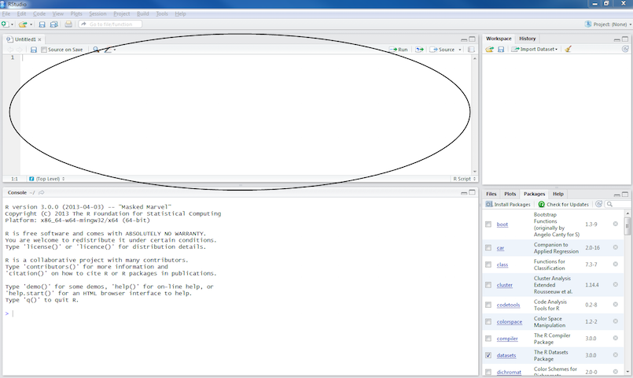

## RStudio

* "RStudio is an integrated development environment (IDE) for R."
* It helps the user use R.
* R, in essence is just the a console that takes commands from you typing into it
* Snapshots taken from http://ayeimanol-r.net/2013/04/21/289/


## 


## 


This is an R Markdown presentation. Markdown is a simple formatting syntax for authoring HTML, PDF, and MS Word documents. For more details on using R Markdown see <http://rmarkdown.rstudio.com>.

When you click the **Knit** button a document will be generated that includes both content as well as the output of any embedded R code chunks within the document.

## Slide with Bullets

- Bullet 1
- Bullet 2
- Bullet 3

## Slide with R Code and Output

```{r}
summary(cars)
```

## Slide with Plot

```{r, echo=FALSE}
plot(cars)
```

